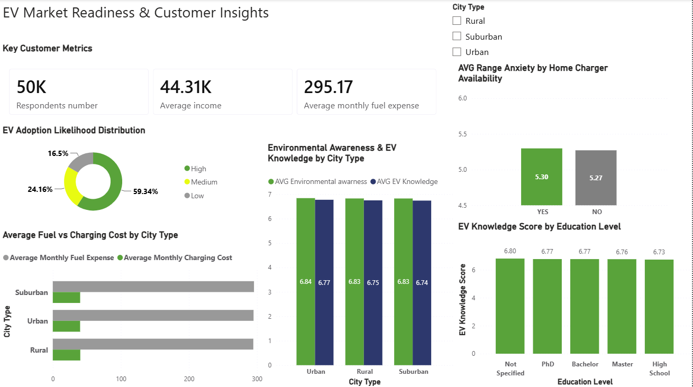

# 🚗 Electric Vehicle (EV) Readiness & Customer Segmentation Analysis

## 📌 Project Overview
This project performs an end-to-end SQL analysis on consumer demographics and Electric Vehicle (EV) readiness data. By bridging customer financial profiles with their environmental attitudes and charging infrastructure accessibility, this analysis identifies high-potential target segments and provides strategic recommendations for EV market expansion.

---

## 📊 Key Business Questions Answered
1. **Financial Feasibility:** What are the average monthly savings for customers transitioning from traditional fuel to electric vehicles across different regions?
2. **Adoption Drivers & Barriers:** How do home charging availability, charging station proximity, and range anxiety influence EV adoption likelihood?
3. **Customer Segmentation:** How does income level correlate with technology affinity, environmental awareness, and EV knowledge?
4. **Regional Benchmarking & Top Earners:** Who are the top 5 highest earners in each region, and how does individual income compare to regional benchmarks?
5. **Market Share Optimization:** Which geographic segments hold the largest share of high-likelihood EV adopters?

---

## 🛠️ Tech Stack & SQL Capabilities
* **Database Management System:** SQLite / SQL Server
* **Data Transformation & Aggregation:** `CAST` / `CONVERT`, `CASE WHEN`, `GROUP BY`, `ORDER BY`
* **Relational Joins:** Multi-table `INNER JOIN` operations (`Dim_Customer` and `Fact_EV_Readiness`)
* **Advanced Analytics & CTEs:** 
  * `WITH` clauses (Common Table Expressions) for modular, readable code.
  * **Window Functions:** `ROW_NUMBER() OVER(PARTITION BY ...)` for top-N ranking per category.
  * **Analytic Benchmarking:** `AVG() OVER(PARTITION BY ...)` for dynamic regional averages.
  * **Overall Aggregations:** `SUM() OVER()` for dynamic total market share calculations.

---

## 🏗️ Relational Database Schema
The analysis relies on a relational star/snowflake schema:
* **`Dim_Customer`**: Contains demographic details (`CustomerID`, `city_type`, `annual_income`, `age`, `daily_commute_km`, `fuel_expense_per_month`, `current_vehicle_type`).
* **`Fact_EV_Readiness`**: Contains behavioral metrics (`monthly_charging_cost`, `home_charging_available`, `range_anxiety_score`, `nearest_charging_station_km`, `ev_adoption_likelihood`, `environmental_awareness_score`, `technology_affinity_score`, `ev_knowledge_score`).

---

## 📊 Power BI Dashboard

To complement the SQL analysis, an interactive **Power BI Dashboard** was developed to visualize key customer insights, EV adoption readiness, and financial comparisons.



### 🔑 Key Visualizations & Features:
* **KPI Header:** Tracks overall respondent metrics (50K total respondents, average income, and average monthly fuel expense).
* **EV Adoption Likelihood:** Breakdown of potential adoption levels across High, Medium, and Low likelihoods.
* **Fuel vs. Charging Cost Comparison:** Highlights the monthly cost savings of electric charging versus traditional fuel across Urban, Suburban, and Rural areas.
* **Range Anxiety vs. Home Charging:** Analyzes how the availability of home charging impacts range anxiety scores.
* **Knowledge & Awareness Score:** Evaluates average EV knowledge levels by education status and environmental awareness across city types.
* **Interactive Slicers:** Allows dynamic filtering by `City Type` for tailored analysis.

---  

## 🚀 Key Insights & Strategic Findings

### 💰 1. Financial Savings & Transition Value
* Customers switching to EVs achieve significant monthly cost savings across all city types (`fuel_expense_per_month` vs. `monthly_charging_cost`).
* Highest fuel expenses were observed in suburban and urban areas, making them prime candidates for cost-benefit marketing strategies.

### 🔋 2. Infrastructure & Range Anxiety Impact
* Home charging availability (`home_charging_available`) significantly reduces range anxiety and strongly correlates with higher EV adoption scores.
* Proximity to public charging stations directly impacts consumer willingness to transition.

### 📈 3. Income Segmentation & Tech Affinity
* **High Income Segment:** Displays the highest scores in technology affinity, EV knowledge, and environmental awareness, leading to the highest EV adoption rates.
* **Middle Income Segment:** Represents a significant opportunity volume, where clear messaging around long-term fuel savings can unlock massive adoption.

### 🏆 4. Regional Market Share
* Using dynamic window functions, the analysis revealed that **Urban and Suburban regions** account for the vast majority of high-likelihood EV adopters (`High` adoption category).

---

## 📂 Repository Structure
```text
├── Portfolio_EV_Analysis.sql   # Full SQL script containing all 11 analytical queries
├── Dim_Customer.csv            # Customer demographic dataset
├── Fact_EV_Readiness.csv       # EV adoption & behavioral dataset
└── README.md                   # Project documentation and summary
